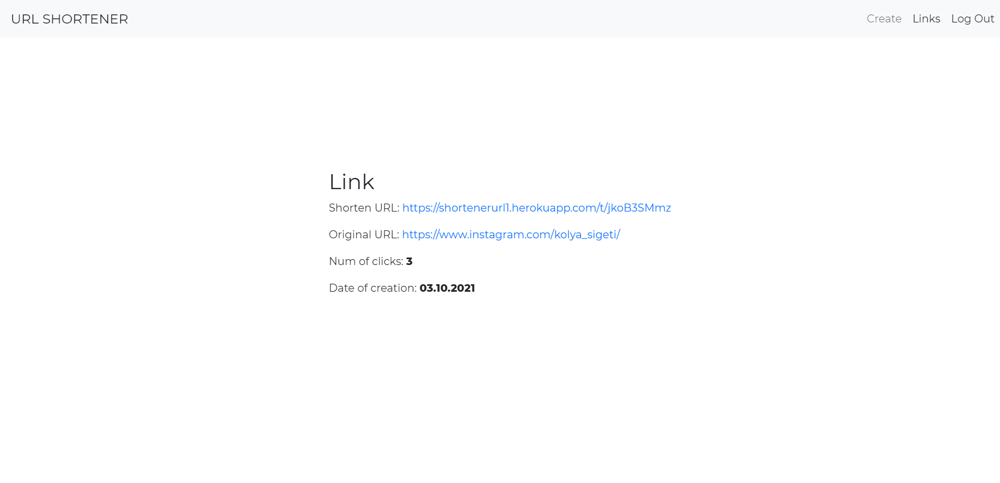

# MERN Application - "Shortener URL"

## **[Shortener URL](https://shortenerurl1.herokuapp.com)**

## **Tech stack used**:

- Language: ES6
- FE: React
- BE: Express
- DB: Mongo

## **Features are implemented:**

- User authentication (login + registration)
- User input validation
- Links

## **Application pages:**

### **The application looks like this.**

### **Authorization**

Login and registration page

### **Links**

Displays links in the list. Its original and shorten version.

### **Detail Link**

Detail info about link.

